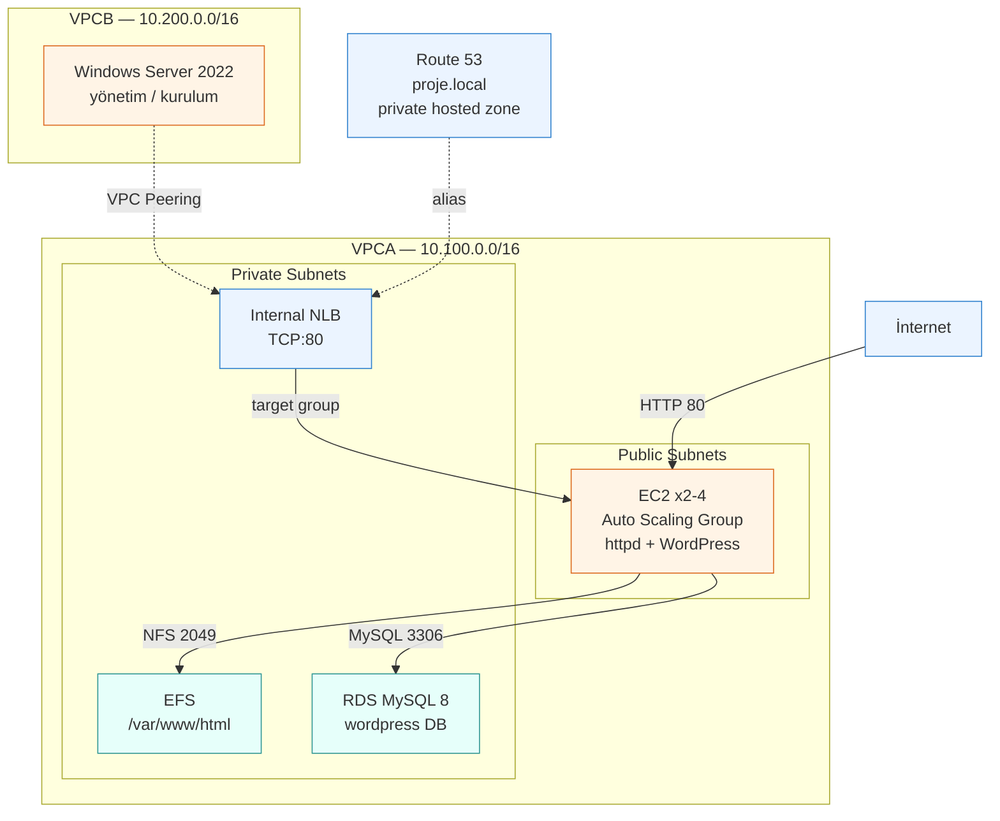
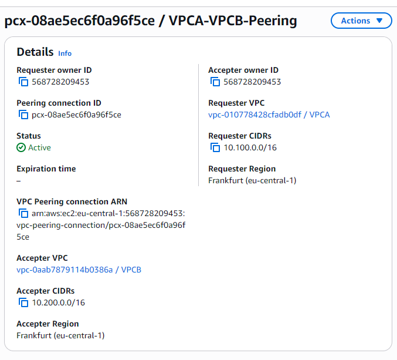
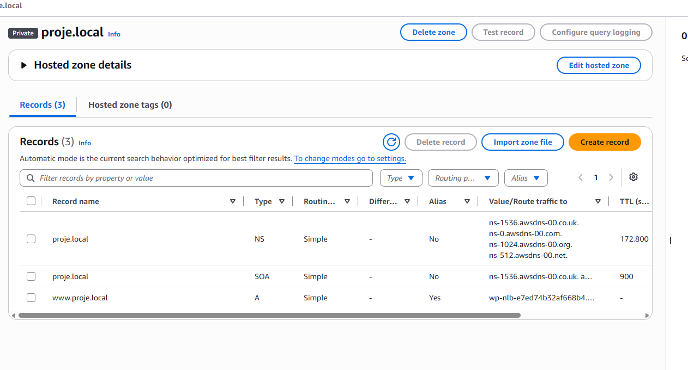
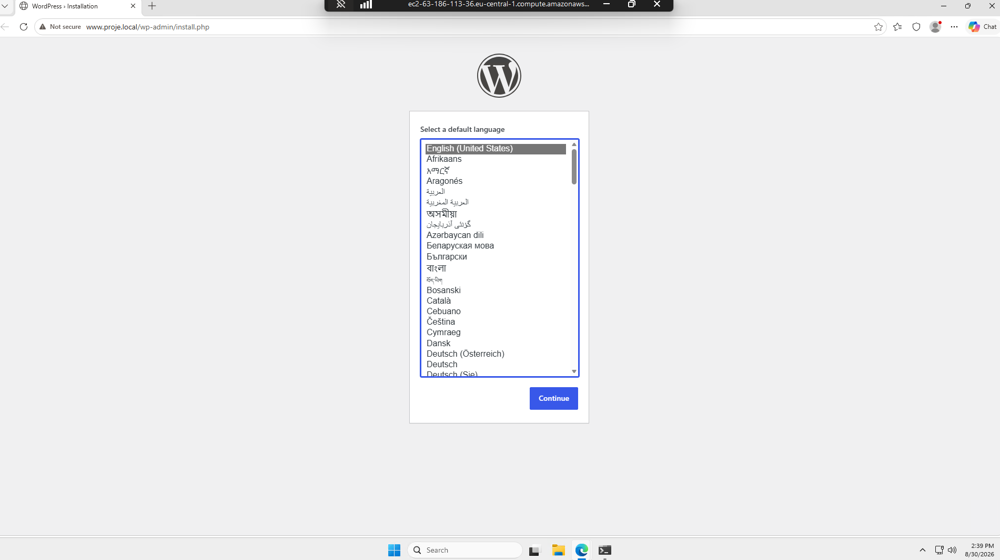
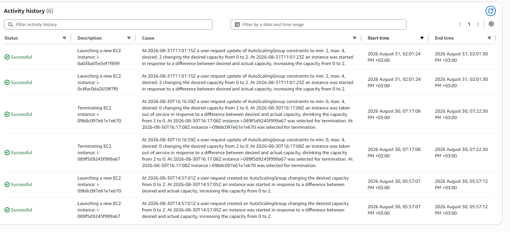
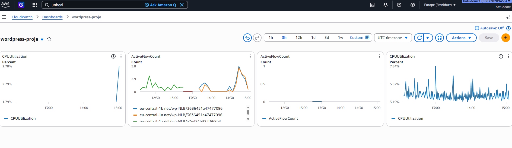

# İki VPC, Bir WordPress: AWS Üzerinde Uçtan Uca Bir Altyapı

Bu repo, AWS öğrenirken yaptığım bir bitirme projesinin notları. Amaç sadece "WordPress kurmak" değildi — iki ayrı VPC arasında peering kurmak, private subnet'lerde veritabanı ve dosya sistemi çalıştırmak, load balancer arkasında otomatik ölçeklenen bir yapı ayağa kaldırmak ve tüm bunları izlenebilir hale getirmekti.

Her şeyi konsoldan, elle yaptım. Terraform kullanmadım çünkü önce her parçanın nereye oturduğunu görmek istedim.

Bir günde bitirmeyi planlamıştım, epey uzadı. Uzamasının sebebi de aslında bu reponun en değerli kısmı: [troubleshooting.md](troubleshooting.md) dosyasında, takıldığım dört yeri ve nasıl çözdüğümü yazdım. Kurulum adımlarından çok orayı okumanızı öneririm.

---

## Mimari



**VPCA** uygulamanın yaşadığı yer. Public subnet'lerde ASG'nin açtığı EC2'ler, private subnet'lerde ise NLB, EFS mount target'ları ve RDS duruyor.

**VPCB** ayrı bir ağ. İçinde sadece bir Windows Server var, oradan WordPress'in kurulumunu tamamladım. Bu, peering'in gerçekten çalıştığını kanıtlamak için iyi bir test oldu — iki farklı VPC'deki makineler `proje.local` üzerinden birbirini bulabiliyor.



---

## Ağ planı

CIDR'ları baştan planladım çünkü peering yapacaksam çakışmamaları gerekiyordu. İkinci okteti farklı seçtim (100 ve 200), böylece ileride üçüncü bir VPC eklesem bile yer kalıyor.

### VPCA — `10.100.0.0/16`

| Subnet | CIDR | AZ | Tip | İçinde ne var |
|---|---|---|---|---|
| PublicSubnet1A | `10.100.0.0/24` | eu-central-1a | Public | EC2 (ASG) |
| PublicSubnet1B | `10.100.1.0/24` | eu-central-1b | Public | EC2 (ASG) |
| PrivateSubnet1A | `10.100.10.0/24` | eu-central-1a | Private | NLB, EFS mount target, RDS |
| PrivateSubnet1B | `10.100.11.0/24` | eu-central-1b | Private | NLB, EFS mount target, RDS |

### VPCB — `10.200.0.0/16`

| Subnet | CIDR | AZ | Tip | İçinde ne var |
|---|---|---|---|---|
| PublicSubnet1A | `10.200.0.0/24` | eu-central-1a | Public | — |
| PublicSubnet1B | `10.200.1.0/24` | eu-central-1b | Public | Windows Server |
| PrivateSubnet1A | `10.200.10.0/24` | eu-central-1a | Private | — |
| PrivateSubnet1B | `10.200.11.0/24` | eu-central-1b | Private | — |

### Route table'lar

Her VPC'de biri public biri private olmak üzere ikişer route table var.

**Public route table (VPCA):**
```
10.100.0.0/16  → local
0.0.0.0/0      → igw-xxxxx
10.200.0.0/16  → pcx-xxxxx     (peering)
```

**Private route table (VPCA):**
```
10.100.0.0/16  → local
10.200.0.0/16  → pcx-xxxxx     (peering)
```

VPCB'de de aynı yapı, CIDR'lar ters. Peering satırını **her iki VPC'nin tüm route table'larına** eklemek gerekiyor — sadece bir tarafa eklemek yetmiyor, cevap paketi dönemiyor.

Private subnet'lerde NAT Gateway kullanmadım. RDS ve EFS internete çıkmıyor, NLB de zaten Internal. Gereksiz maliyetten kaçındım.

### Route 53 private hosted zone

`proje.local` zone'u her iki VPC'ye de associate edildi. `www.proje.local` kaydı, Internal NLB'yi gösteren bir alias.



---

## Güvenlik tasarımı

Projedeki en önemli tasarım kararı Security Group'larda **IP yerine SG referansı** kullanmaktı.

| Security Group | VPC | Inbound | Kaynak | Neden |
|---|---|---|---|---|
| `Ec2SecGroup` | VPCA | HTTP (80), SSH (22) | `0.0.0.0/0` | Web sunucusu, dışa açık |
| `NFSSecGroup` | VPCA | NFS (2049) | **`Ec2SecGroup`** | Sadece uygulama sunucuları EFS'e bağlanabilsin |
| `RDSSecGroup` | VPCA | MySQL (3306) | **`Ec2SecGroup`** | Sadece uygulama sunucuları veritabanına erişebilsin |
| `RDPsecGroup` | VPCB | RDP (3389) | `0.0.0.0/0` | Yönetim makinesine erişim |

### Neden SG referansı, IP değil

`NFSSecGroup`'ta kaynak olarak bir IP yazsaydım, ASG yeni bir makine açtığında (farklı private IP alacak) o makine EFS'e erişemezdi. Her yeni instance için kuralı elle güncellemem gerekirdi.

SG referansı kullanınca: `Ec2SecGroup`'a sahip **her** makine otomatik olarak izinli oluyor. ASG 2'den 4'e çıksa da, makineler değişse de kural bir kere yazıldı, sonsuza kadar geçerli.

Aynı mantık RDS için de geçerli.

### Katmanlı koruma

```
İnternet
   ↓ (HTTP, SSH)
Ec2SecGroup → EC2 (public subnet)
   ↓ NFS, sadece Ec2SecGroup'tan     ↓ MySQL, sadece Ec2SecGroup'tan
NFSSecGroup → EFS                 RDSSecGroup → RDS
   (private subnet)                  (private subnet)
```

EFS ve RDS iki katmanla korunuyor: hem private subnet'te oldukları için internetten fiziksel yol yok, hem de SG seviyesinde sadece belirli bir SG'den gelen trafiğe izin veriliyor.

---

## Kullandığım servisler

| Servis | Yapılandırma |
|---|---|
| VPC | 2 adet, 4'er subnet, peering |
| Route 53 | `proje.local` private hosted zone, iki VPC'ye de associate |
| NLB | Internal, TCP:80, target group ile ASG'ye bağlı |
| EC2 + ASG | Amazon Linux 2023, t2.micro, min 2 max 4 |
| EFS | `/var/www/html`'e mount, fstab ile kalıcı |
| RDS | MySQL 8.0, db.t3.micro, private subnet, Free Tier |
| CloudWatch | Agent ile httpd logları + dashboard |
| IAM | EC2'ye CloudWatch yazma yetkisi (instance profile) |

---

## Neden böyle kurdum

**Neden EFS, EBS değil?**
ASG 2-4 makine açıyor. Kullanıcı bir resim yüklediğinde, o dosya sadece bir makinede kalırsa diğerine düşen istek onu göremez. EBS tek instance'a bağlanıyor, bu yüzden işe yaramıyor. EFS birden fazla makineye aynı anda mount edilebiliyor, WordPress'in `wp-content/uploads` sorunu böyle çözülüyor.

**Neden RDS private subnet'te?**
Veritabanının internetten erişilebilir olması için hiçbir sebep yok. Private subnet'e koyunca, Security Group'u yanlış yazsam bile dışarıdan fiziksel bir yol kalmıyor.

**Neden Internal NLB?**
İlk başta Internet-facing kurmuştum ve VPCB'den erişemedim. Route 53 alias kaydı, peered VPC'den sorgulandığında public IP döndürüyor ve trafik peering yerine internetten gitmeye çalışıyor. Sebebini [troubleshooting.md](troubleshooting.md#3-internet-facing-nlb-peered-vpcden-erişilemiyor) dosyasında anlattım.

**Neden `/etc/fstab`'da `_netdev`?**
EFS bir ağ dosya sistemi. `_netdev` seçeneği olmadan, makine boot ederken ağ henüz hazır değilken mount denemesi yapıyor ve başarısız oluyor. ASG'nin açtığı yeni makineler için bu kritik — o satır olmasa yeni makineler WordPress dosyalarını göremezdi.

**Neden NAT Gateway yok?**
Private subnet'lerdeki hiçbir kaynağın internete çıkma ihtiyacı yok. RDS ve EFS zaten AWS servisleri, NLB de Internal. NAT Gateway saatlik ücretli, gereksiz yere maliyet ekliyor.

---

## Kurulum sırası

Sıra önemli, çünkü her adım bir öncekine bağlı:

1. İki VPC, subnet'ler, IGW, route table'lar
2. Peering (ve **her iki tarafın** route table'ına satır ekleme)
3. Security Group'lar
4. Route 53 private zone, iki VPC'ye associate
5. Target group + Internal NLB, zone'a alias kaydı
6. EC2 aç, httpd kur
7. EFS oluştur, `/var/www/html`'e mount, fstab'a ekle
8. RDS kur (subnet group + SG önce hazır olmalı)
9. WordPress dosyalarını EFS'e kopyala, `wp-config.php`'de RDS endpoint'ini gir
10. CloudWatch Agent kur, logları gönder
11. VPCB'de Windows aç, oradan WordPress kurulumunu tamamla
12. Çalışan makineden AMI al
13. Launch template + ASG, NLB'ye bağla
14. CloudWatch dashboard

---

## Doğrulama

Her katmanın çalıştığını ayrı ayrı test ettim. "Kurdum" ile "çalıştığını gördüm" farklı şeyler.

### DNS ve NLB zinciri

VPCA'daki EC2'den:

```bash
curl http://www.proje.local
```

```html
<title>It works!  Apache httpd</title>
```

Bu tek çıktı şunu kanıtlıyor: Route 53 private zone çözümleniyor → NLB isteği alıyor → target group'a yönlendiriyor → EC2 cevap veriyor.

### RDS bağlantısı

```bash
curl -I http://www.proje.local
```

```
HTTP/1.1 302 Found
X-Redirect-By: WordPress
Location: http://www.proje.local/wp-admin/install.php
```

WordPress'in `install.php`'ye yönlendirme yapması, **veritabanına başarıyla bağlandığı** anlamına geliyor. Bağlanamasaydı "Error establishing a database connection" görürdüm.

### EFS mount

```bash
df -h | grep html
```

```
fs-xxxx.efs.eu-central-1.amazonaws.com:/  8.0E  0  8.0E  0%  /var/www/html
```

`8.0E` (exabyte) görünmesi normal — EFS boyut sınırı koymuyor.

Kalıcılık testi:
```bash
sudo umount /var/www/html
sudo mount -a          # fstab'ı okur, reboot simülasyonu
df -h | grep html      # tekrar mount edilmiş olmalı
```

### Peering (asıl test)

VPCB'deki Windows makineden, Edge tarayıcısıyla:

```
http://www.proje.local/wp-admin/install.php
```



WordPress kurulum ekranının açılması, projenin en kritik doğrulaması oldu. Çünkü bu tek sayfa şunların **hepsinin** aynı anda çalıştığını gösteriyor:

- VPC Peering (VPCB → VPCA)
- Route 53 private zone'un iki VPC'den de çözümlenmesi
- Internal NLB → target group → EC2 zinciri
- EFS mount (WordPress dosyaları orada)
- RDS bağlantısı
- Security Group zinciri

### Auto Scaling

ASG'nin açtığı makineler target group'ta `healthy` olduğunda, AMI'nin doğru çalıştığı doğrulanmış oluyor — yeni makineler otomatik olarak httpd'yi başlatıyor, EFS'i mount ediyor ve WordPress'i servis ediyor.

Activity history, ASG'nin hem scale-out hem scale-in yaptığını gösteriyor. `Cause` sütununda hangi kısıt değişikliğinin hangi işlemi tetiklediği yazılı.



### CloudWatch

Log group'larda (`wordpress-access-log`, `wordpress-error-log`) gerçek log satırlarının düşmesi, agent'ın çalıştığını ve IAM role'ün doğru olduğunu gösteriyor.

Dashboard'a EC2 CPU, ASG instance sayısı, NLB bağlantı sayısı ve RDS metriklerini widget olarak ekledim.



---

## Maliyet ve temizlik

Bu proje Free Tier hesabında yapılmadı, o yüzden maliyete dikkat etmek gerekti.

**Ücretli kalemler:**

| Kaynak | Yaklaşık maliyet |
|---|---|
| NLB | ~$0.03/saat (sabit) |
| EC2 (t2.micro × 2-4) | ~$0.013/saat/makine |
| RDS (db.t3.micro) | ~$0.018/saat |
| EFS | Kullanılan GB başına |
| Elastic IP (bağlıyken) | Ücretsiz |
| Windows Server | Linux'tan pahalı (lisans) |

En pahalı kalem load balancer. Saatlik sabit ücret alıyor, kullanılsa da kullanılmasa da.

**Silme sırası önemli:**

1. **ASG'yi sil** (önce desired/min/max'ı 0 yap) — yoksa sildiğin makinelerin yerine yenisini açar
2. Kalan EC2'leri terminate et
3. NLB'yi sil
4. Target group'u sil
5. RDS'i sil (final snapshot isteyip istemediğini sorar)
6. EFS'i sil
7. Elastic IP'leri release et — **bağlı değilken ücretli**, unutulursa aylarca para yakar
8. NAT Gateway varsa sil
9. Peering connection'ı sil
10. VPC'leri sil (içindeki subnet, route table, IGW ile birlikte gider)

En sık unutulan: **boşta kalan Elastic IP** ve **silinmemiş EBS volume'lar**. İkisi de sessizce fatura biriktirir.

---

## Takıldığım yerler

Dört ayrı sorunda toplam birkaç saat kaybettim:

1. **EFS mount olmuyordu** — VPC'de DNS hostnames kapalıydı
2. **NLB'ye kendi target'ından erişilemiyordu** — hairpinning kısıtı
3. **Internet-facing NLB peered VPC'den erişilemiyordu** — Route 53 public IP döndürüyordu
4. **Windows'tan hiçbir şeye ulaşılamıyordu** — kaynak SG'nin outbound'u kısıtlıydı

Hepsinin detaylı teşhis sürecini [troubleshooting.md](troubleshooting.md) dosyasına yazdım. Bence bu repo'nun en faydalı kısmı orası.

---

## Dosyalar

- **[troubleshooting.md](troubleshooting.md)** — takıldığım dört yer, nasıl teşhis ettiğim ve çözümler
- `configs/` — CloudWatch agent config, fstab satırı, Security Group kuralları
- `scripts/` — WordPress, EFS mount ve CloudWatch Agent kurulum adımları
- `screenshots/` — çalışan sistemin ekran görüntüleri

---

## Öğrendiklerim

Kurulum kısmı beklediğim gibiydi, dokümantasyonu takip edince oluyor. Asıl zaman **çalışmayan şeyleri bulmaya** gitti.

Bir bağlantı kurulamadığında bakılacak yerlerin sırası kafamda oturdu: route table var mı, security group hem kaynakta hem hedefte izin veriyor mu, NACL bir şey kesiyor mu, DNS doğru IP'yi mi döndürüyor. Bunları sistematik elemek, rastgele ayar değiştirmekten çok daha hızlı.

Bir de şunu öğrendim: test ettiğin makine, test ettiğin sistemin parçası olmamalı. NLB'yi kendi target'ından test etmeye çalışıp bir saat kaybettim.

---

## Sonrası

Bu projeyi Terraform'a çevirmek istiyorum. Konsoldan tıklayarak kurduğum her şeyin kod karşılığını yazmak, hem tekrarlanabilir hale getirir hem de gerçekten anlayıp anlamadığımı test eder.
